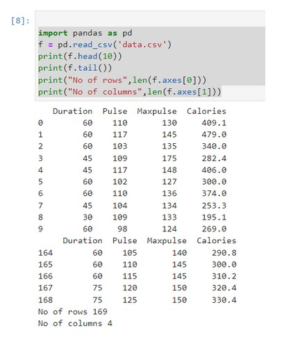

# Read-from-CSV

## AIM:
To write a program to read from csv
## ALGORITHM:
### Step 1:
load the csv into a data frame
### Step 2:
print the number of contents to be displayed using df.head()
### Step 3:
The number of rows returned is defined in pandas option settings
### Step 4:
check your systems maximum column with the pd.options.display.max_columns statement
### Step 5:
increase the maximum number of rows to display the entire data frame
## PROGRAM:
~~~
import pandas as pd
df = pd.read_csv('data.csv')
print(df.head(10))
print(df.tail())
print("no. of column",len(df.axes[0]))
print("no. of rows",len(df.axes[1])
~~~
## OUTPUT:

## RESULT:
Thus a python program is written to read the contents of a csv file.
